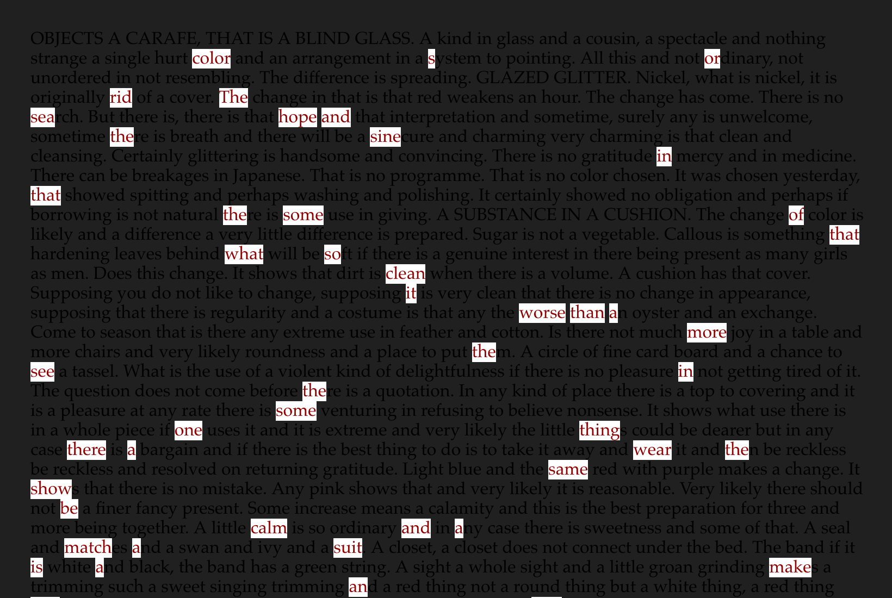

README
======

Excavate is a NaNoGenMo project to unearth a hidden narrative from one text using an RNN trained on another text, after the manner of Tom Phillips' *A Humument*

The final version is here: [I PROGNOS MEMBERS](https://etc.mikelynch.org/nanogenmo2019), a 50k+ word text extracted from Robert Burton's *The Anatomy of Melancholy* by an RNN trained on *The Three Musketeers*.

Here is [my blog post](https://mikelynch.org/2019/Nov/22/excavate/) about the project.

## How to run it

This repository contains the pre-and post-processing script. To run the entire project, you'll need to install [my fork of J C Johnson's torch-rnn](https://github.com/spikelynch/torch-rnn/). The installation process is covered in that repository's README: it's a bit of a pain but the same for my fork as for the original.

You'll also need a torch-rnn checkpoint trained on something.

### Install the excavate_postprocess script

Once you've installed node and npm, cd into the excavate_postprocess directory and run 'npm install'

### Make the vocabulary file

Your primary text needs to be preprocessed into a vocabulary file using the excavateHTML.js script. The primary can be text, Markdown or HTML.

    ./excavateHTML.js --primary ../Samples/tender_buttons.txt --extract ../Samples/tender_buttons_vocab.txt

### Run the excavate algorithm

    th excavate.lua -checkpoint cv/Fort1cp_440000.t7 -vocab ~/Desktop/NaNoGenMo2019/Samples/tender_buttons_vocab.txt -excavate 25 -length 10000 -name tender_fort -outdir Samples/

Important command-line options:

* -checkpoint - the trained RNN
* -vocab - the vocabulary file
* -excavate - the lookahead size, controls how far ahead the vocabulary is sampled
* -length - number of characters to generate
* -name - name of this run, used to name output files
* -outdir - directory to write output files

The results from an RNN trained on Charles Fort's *Book of the Damned* with the vocabulary from Gertrude Stein's *Tender Buttons*:

> , coloræs or rid. The sea hope and the sine in that the some of that what so clean it worse than a more the see in the some one thing there a wear the same show--be calm and a match a suit is a make an and sew-same strip of an eye" be substance to table. The more negative sound and hanging more not side and a for the scatter one way on the ribbon. I has not to color to the red rose the surrounding let a cause of this exchange is a success if they will not bo--
>
> "Suppose, out is neatly an it.

## Postprocess to mark up the original text

excavate.lua will write out two files: the plain text generated by the RNN algorithm, and a json file which has the text matched against the index numbers from the original vocabulary.

    tender_fort.txt
    tender_fort.json

The postprocess script can be used to generate a copy of the original primary text with the results highlighed with HTML tags. This also works if the primary is a plain text file: I don't know what it will do with Markdown.

    ./excavateHTML.js --primary ../Samples/tender_buttons.txt --wordlist ../Samples/tender_fort.json --output tender_fort.html

The output HTML will look something like this

    

## Dependencies

[My fork of J C Johnson's torch-rnn](https://github.com/spikelynch/torch-rnn/)

node.js and npm for the postprocessing script in excavate_postprocess

